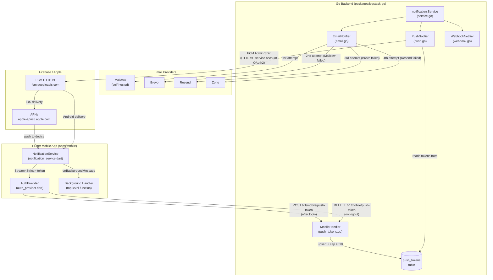
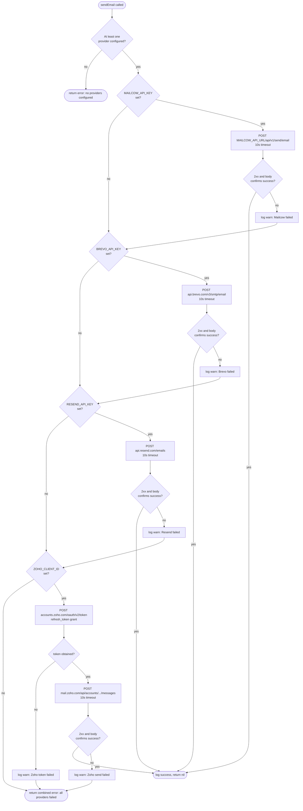
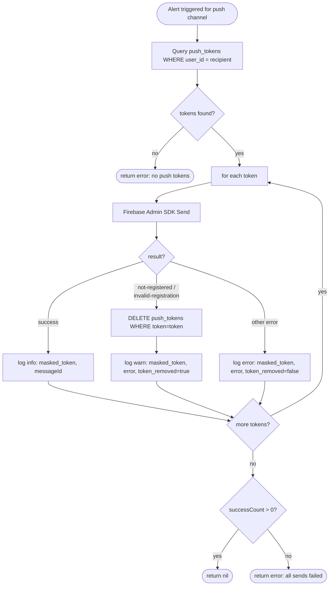
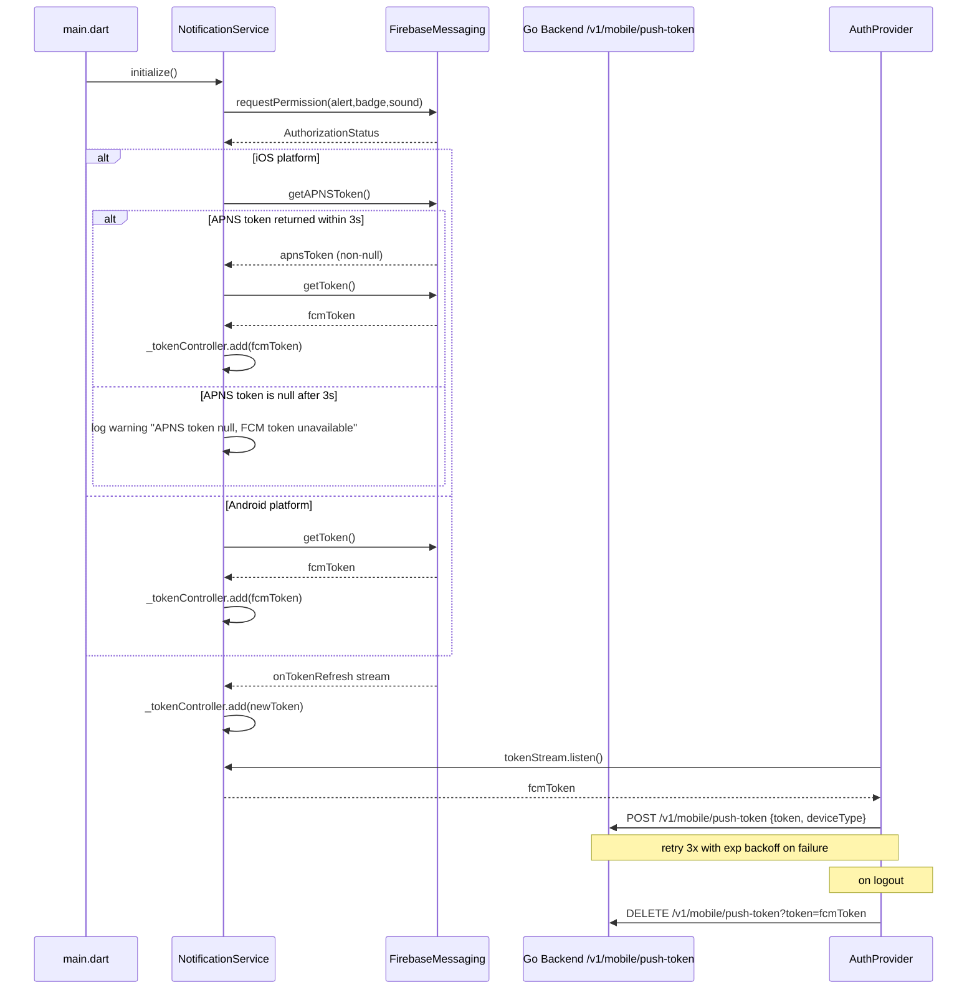

# Design Document: Logstack Notifications System

## Overview

This document describes the technical design for the Logstack Notifications System, covering:

1. **Multi-provider email delivery** with a Mailcow → Brevo → Resend → Zoho failover chain
2. **FCM push notifications** via the Firebase Admin SDK HTTP v1 API on the Go backend
3. **Flutter mobile client** changes for APNS token gating, background handlers, token streaming, and backend registration

The system builds on existing infrastructure in `packages/logstack-go/internal/services/notification/` and `apps/mobile/lib/services/notification_service.dart`. All changes are additive or refactors of existing files — no new top-level packages are introduced.

### Key Design Decisions

- **Strategy pattern** for email providers: each provider is a struct implementing a `EmailProvider` interface, making the chain trivially extensible and independently testable.
- **APNS-first gating on iOS**: FCM token retrieval is deferred until an APNS token is confirmed non-null, which is the critical fix for TestFlight delivery failures.
- **Graceful degradation**: missing provider credentials skip that provider at startup; the system works with any subset of providers configured.
- **10-token cap** is enforced at the database layer inside `RegisterPushToken`, removing the oldest `push_token` by `created_at` when the 11th would be added.


---

## Architecture

### System Architecture Diagram




### Email Provider Failover Flow




### Push Notification Dispatch Flow




### Flutter APNS Token Gating Flow (iOS)




---

## Components and Interfaces

### Go Backend Changes

#### `notification/email.go` — Refactor to Multi-Provider Chain

The current `EmailNotifier` is tightly coupled to Brevo. It will be refactored using the **strategy pattern**:

```go
// EmailProvider is the interface every provider struct implements.
type EmailProvider interface {
    Name() string
    IsConfigured() bool
    Send(ctx context.Context, to, toName, subject, htmlBody string) error
}

// EmailNotifier composes an ordered chain of EmailProvider implementations.
type EmailNotifier struct {
    providers []EmailProvider
    baseURL   string
}
```

Provider structs (all in `email.go`):

| Struct | Credentials read | Endpoint |
|---|---|---|
| `mailcowProvider` | `MAILCOW_API_KEY`, `MAILCOW_API_URL` | `POST {MAILCOW_API_URL}/api/v1/send/email` |
| `brevoProvider` | `BREVO_API_KEY` | `POST https://api.brevo.com/v3/smtp/email` |
| `resendProvider` | `RESEND_API_KEY` | `POST https://api.resend.com/emails` |
| `zohoProvider` | `ZOHO_CLIENT_ID`, `ZOHO_CLIENT_SECRET`, `ZOHO_REFRESH_TOKEN` | OAuth token then `POST https://mail.zoho.com/api/accounts/{id}/messages` |

Each provider gets its own `*http.Client` with `Timeout: 10 * time.Second`.

`EmailNotifier.sendEmail()` becomes the chain executor:

```go
func (e *EmailNotifier) sendEmail(ctx context.Context, to, toName, subject, htmlBody string) error {
    if !e.hasConfiguredProvider() {
        return fmt.Errorf("no email providers configured")
    }
    var errs []string
    for i, p := range e.providers {
        if !p.IsConfigured() {
            continue
        }
        start := time.Now()
        slog.Debug("attempting email provider", "provider", p.Name(), "recipient", maskEmail(to), "attempt", i+1)
        if err := p.Send(ctx, to, toName, subject, htmlBody); err != nil {
            slog.Warn("email provider failed", "provider", p.Name(), "error", err, "elapsed", time.Since(start))
            errs = append(errs, fmt.Sprintf("%s: %v", p.Name(), err))
            continue
        }
        slog.Info("email delivered", "provider", p.Name(), "elapsed_total", time.Since(start))
        return nil
    }
    return fmt.Errorf("all email providers failed: %s", strings.Join(errs, "; "))
}
```


#### `notification/push.go` — Invalid Token Cleanup

The existing `PushNotifier.Send()` loop already handles individual token failures. The addition is detecting the two FCM error codes that indicate a permanently-invalid token and deleting the DB record:

```go
import "firebase.google.com/go/v4/messaging"

// inside the send loop, after p.client.Send() returns an error:
if messaging.IsRegistrationTokenNotRegistered(err) ||
    messaging.IsInvalidArgument(err) {
    // token is permanently invalid — remove from DB
    p.db.Where("token = ?", token.Token).Delete(&models.PushToken{})
    slog.Warn("deleted stale push token",
        "token", maskToken(token.Token),
        "error", err,
        "token_removed", true,
    )
    continue
}
slog.Error("push send failed",
    "token", maskToken(token.Token),
    "error", err,
    "token_removed", false,
)
```

#### `api/handlers/mobile/push_tokens.go` — 10-Token Cap

After confirming the token is new (not an upsert), check and enforce the cap before inserting:

```go
// Before creating a new token record:
var tokenCount int64
h.db.Model(&models.PushToken{}).Where("user_id = ?", userID).Count(&tokenCount)
if tokenCount >= 10 {
    // Find and delete the oldest token
    var oldest models.PushToken
    if err := h.db.Where("user_id = ?", userID).
        Order("created_at ASC").First(&oldest).Error; err == nil {
        h.db.Delete(&oldest)
    }
}
// then proceed with h.db.Create(&token)
```

#### `config/config.go` — New Fields

Add to `Config` struct and `Load()`:

```go
// Email providers
MailcowAPIKey    string
MailcowAPIURL    string
ResendAPIKey     string
ZohoClientID     string
ZohoClientSecret string
ZohoRefreshToken string
```

Loaded via:
```go
MailcowAPIKey:    getEnv("MAILCOW_API_KEY", ""),
MailcowAPIURL:    getEnv("MAILCOW_API_URL", ""),
ResendAPIKey:     getEnv("RESEND_API_KEY", ""),
ZohoClientID:     getEnv("ZOHO_CLIENT_ID", ""),
ZohoClientSecret: getEnv("ZOHO_CLIENT_SECRET", ""),
ZohoRefreshToken: getEnv("ZOHO_REFRESH_TOKEN", ""),
```

No validation failures on missing values — graceful degradation is handled inside `EmailNotifier`.

#### `notification/service.go` — Updated Constructor + Startup Logging

`NewNotificationService` and `NewNotificationServiceWithDB` receive the expanded config. On startup, log which email providers are active and whether push is enabled:

```go
func NewNotificationServiceWithDB(cfg *config.Config, db *gorm.DB) *Service {
    email := NewEmailNotifier(cfg, cfg.BaseURL)
    // email.go logs active providers at construction time

    push, err := NewPushNotifier(cfg.FCMServiceAccountPath, cfg.FCMProjectID, db)
    if err != nil {
        slog.Warn("push notifier disabled", "error", err)
        push = nil
    }

    return &Service{email: email, push: push, webhook: NewWebhookNotifier()}
}
```


### Flutter Changes

#### `notification_service.dart` — APNS Gating, Background Handler, Token Stream

Key additions:

```dart
// Top-level background handler (must be top-level, not a class method)
@pragma('vm:entry-point')
Future<void> _firebaseMessagingBackgroundHandler(RemoteMessage message) async {
  await Firebase.initializeApp(options: DefaultFirebaseOptions.currentPlatform);
  // handle background message — log or route
}

class NotificationService {
  // Token stream so AuthProvider can react to new/refreshed tokens
  final _tokenController = StreamController<String>.broadcast();
  Stream<String> get tokenStream => _tokenController.stream;

  Future<void> initialize() async {
    // Register background handler FIRST before any other Firebase calls
    FirebaseMessaging.onBackgroundMessage(_firebaseMessagingBackgroundHandler);

    final settings = await _messaging.requestPermission(
      alert: true, badge: true, sound: true, provisional: false,
    );

    if (settings.authorizationStatus == AuthorizationStatus.authorized ||
        settings.authorizationStatus == AuthorizationStatus.provisional) {
      await _initializeLocalNotifications();
      await _initializeFCM();
    }
  }

  Future<void> _initializeFCM() async {
    if (Platform.isIOS) {
      // APNS gating: wait up to 3 seconds for APNS token before fetching FCM token
      String? apnsToken;
      try {
        apnsToken = await _messaging.getAPNSToken()
            .timeout(const Duration(seconds: 3));
      } catch (_) {
        apnsToken = null;
      }

      if (apnsToken == null) {
        _logger.w('APNS token is null — FCM token unavailable on this iOS device. '
            'Ensure APNS is configured correctly for this environment (sandbox for TestFlight).');
        return; // Do NOT attempt to get FCM token without APNS token
      }
    }

    _fcmToken = await _messaging.getToken();
    if (_fcmToken != null) {
      _tokenController.add(_fcmToken!);
    }

    _messaging.onTokenRefresh.listen((token) {
      _fcmToken = token;
      _tokenController.add(token);
    });

    FirebaseMessaging.onMessage.listen(_handleForegroundMessage);
    FirebaseMessaging.onMessageOpenedApp.listen(_handleMessageOpenedApp);

    final initialMessage = await _messaging.getInitialMessage();
    if (initialMessage != null) _handleInitialMessage(initialMessage);
  }

  // Call on app teardown / logout cleanup
  void dispose() {
    _tokenController.close();
  }
}
```

#### `auth_provider.dart` — Token Registration and Deregistration

`AuthNotifier` subscribes to the token stream after successful login and deregisters on logout:

```dart
class AuthNotifier extends StateNotifier<AuthState> {
  StreamSubscription<String>? _tokenSubscription;
  String? _currentFcmToken;

  // Called from login() after state is set to authenticated:
  void _listenForFcmToken(ApiClient apiClient) {
    _tokenSubscription?.cancel();
    _tokenSubscription = NotificationService.instance.tokenStream.listen((token) async {
      _currentFcmToken = token;
      await _registerPushToken(apiClient, token);
    });
    // Also register current token if already available
    final existing = NotificationService.instance.fcmToken;
    if (existing != null) _registerPushToken(apiClient, existing);
  }

  Future<void> _registerPushToken(ApiClient apiClient, String token) async {
    const maxRetries = 3;
    for (int attempt = 0; attempt < maxRetries; attempt++) {
      try {
        await apiClient.post('/mobile/push-token', data: {
          'token': token,
          'deviceType': Platform.isIOS ? 'ios' : 'android',
        });
        return; // success
      } catch (e) {
        if (attempt < maxRetries - 1) {
          await Future.delayed(Duration(seconds: 1 << attempt)); // 1s, 2s, 4s
        } else {
          // log failure after all retries
        }
      }
    }
  }

  Future<void> logout() async {
    if (_currentFcmToken != null) {
      try {
        await _apiClient.delete('/mobile/push-token?token=${_currentFcmToken}');
      } catch (_) {}
    }
    _tokenSubscription?.cancel();
    _tokenSubscription = null;
    _currentFcmToken = null;
    await _authService.logout();
    state = AuthState();
  }
}
```


---

## Data Models

### `push_tokens` Table (existing, no schema change)

| Column | Type | Notes |
|---|---|---|
| `id` | uint (PK) | auto-increment |
| `user_id` | uint (FK) | indexed, `users.id` |
| `token` | text (unique) | FCM registration token |
| `device_type` | varchar(10) | `ios` or `android` |
| `created_at` | timestamp | used for oldest-token eviction |
| `updated_at` | timestamp | updated on upsert |

**Cap enforcement**: the `RegisterPushToken` handler queries `COUNT(*) WHERE user_id = ?` before each insert. If the count is ≥ 10, it selects the record with the minimum `created_at` for that user and deletes it first. This is done in the handler layer (not a DB trigger) to keep the logic explicit and testable.

**Invalid-token cleanup**: `PushNotifier.Send()` calls `DELETE WHERE token = ?` inline when FCM returns `registration-token-not-registered` or `invalid-registration-token`. No scheduled cleanup job is needed.

### Config Fields Added

```go
// In config.Config
MailcowAPIKey    string  // MAILCOW_API_KEY
MailcowAPIURL    string  // MAILCOW_API_URL — base URL of self-hosted Mailcow, e.g. https://mail.example.com
ResendAPIKey     string  // RESEND_API_KEY
ZohoClientID     string  // ZOHO_CLIENT_ID
ZohoClientSecret string  // ZOHO_CLIENT_SECRET
ZohoRefreshToken string  // ZOHO_REFRESH_TOKEN
// Already present:
BrevoAPIKey           string  // BREVO_API_KEY
FCMServiceAccountPath string  // FCM_SERVICE_ACCOUNT_PATH
FCMProjectID          string  // FCM_PROJECT_ID
```

### Zoho OAuth2 Token Response

```go
type zohoTokenResponse struct {
    AccessToken string `json:"access_token"`
    ExpiresIn   int    `json:"expires_in"`
    TokenType   string `json:"token_type"`
    Error       string `json:"error,omitempty"`
}
```

The Zoho provider fetches a fresh access token on every `Send()` call (no caching). This is intentional for simplicity — Zoho is the last-resort fallback, not the hot path.

### Provider Response Validation

Each provider's `Send()` method must parse the response body even on 2xx to detect accepted-vs-rejected:

| Provider | 2xx success indicator |
|---|---|
| Mailcow | Response body is a JSON array; first element has `type: "success"` |
| Brevo | HTTP 201 with `{"messageId": "..."}` |
| Resend | HTTP 200 with `{"id": "..."}` |
| Zoho | HTTP 200 with `{"status": {"code": 200}}` |

Any 2xx response that does not match the above pattern is treated as a soft failure and the chain continues.


---

## Correctness Properties

*A property is a characteristic or behavior that should hold true across all valid executions of a system — essentially, a formal statement about what the system should do. Properties serve as the bridge between human-readable specifications and machine-verifiable correctness guarantees.*

**PBT applicability assessment**: This feature involves pure business logic functions (email provider chain selection, token-cap enforcement, retry backoff calculation, FCM message payload construction) that are all parameterized over meaningful input spaces. PBT applies well and will use **`gopkg.in/check.v1` + `pgregory.net/rapid`** for Go and **`package:rapid`** for Dart.

**Property Reflection — redundancy eliminated before writing:**
- Requirements 3.4 (APNS priority) and 3.5 (Android priority) can be merged into a single FCM message payload structure property since they both assert structural invariants on the FCM message constructed from any (rule, log) pair.
- Requirements 10.4 and 10.5 are merged into Requirement 3.8 (push log structure property).
- Requirements 3.3 (send to every token) and 3.6 (delete invalid tokens) are kept separate because they have different pre-conditions and assertions.
- Requirements 4.1 (ordering) and 4.2 (failover on error) can be combined into a single chain-order property since they both assert order of attempts.

---

### Property 1: FCM Token Stream Emission

*For any* FCM token string obtained via `getToken()` or emitted by `onTokenRefresh`, the `NotificationService.tokenStream` SHALL emit that exact token value unchanged.

**Validates: Requirements 1.8**

---

### Property 2: Push Token Registration Retry Backoff

*For any* sequence of consecutive `POST /v1/mobile/push-token` failures (up to 3 attempts), the retry delays SHALL follow exponential backoff with base 1 second: attempt 1 delay = 1s, attempt 2 delay = 2s, and no further attempts are made after the 3rd failure.

**Validates: Requirements 2.4**

---

### Property 3: Push Token Cap Invariant

*For any* user and *any* sequence of `RegisterPushToken` calls, after every call the total count of `push_tokens` records for that user SHALL be ≤ 10. When the count would exceed 10, the record with the earliest `created_at` SHALL be deleted before inserting the new token.

**Validates: Requirements 2.6**

---

### Property 4: FCM Send Attempts Match Token Count

*For any* user with N registered push tokens (1 ≤ N ≤ 10), triggering a push alert for that user SHALL result in exactly N FCM `Send()` calls, one per token.

**Validates: Requirements 3.3**

---

### Property 5: FCM Message Payload Structure

*For any* `AlertRule` and `Log` values, the FCM message constructed by `PushNotifier.Send()` SHALL:
- Have `APNS.Headers["apns-priority"] = "10"` and `APNS.Payload.Aps.Sound = "default"` for iOS delivery
- Have `Android.Priority = "high"` for Android delivery

**Validates: Requirements 3.4, 3.5**

---

### Property 6: Invalid Token Cleanup

*For any* push token that causes FCM to return a `registration-token-not-registered` or `invalid-registration-token` error, that token SHALL be absent from the `push_tokens` table after the send attempt completes.

**Validates: Requirements 3.6**

---

### Property 7: Push Notification Structured Logging

*For any* FCM send attempt (success or failure), the log entry SHALL contain a masked token field. On success it SHALL also contain the Firebase message ID. On failure it SHALL contain the error detail and a boolean `token_removed` field.

**Validates: Requirements 3.8, 10.4, 10.5**

---

### Property 8: Email Provider Chain Ordering and Failover

*For any* email send request and *any* combination of provider failures (where a provider can fail via 4xx/5xx/3xx status, connection error, or 2xx with error body), the order of provider attempts SHALL always be Mailcow → Brevo → Resend → Zoho, and a failed attempt on provider N SHALL always trigger an attempt on provider N+1 (if configured).

**Validates: Requirements 4.1, 4.2**

---

### Property 9: Provider Success Short-Circuits the Chain

*For any* provider N that returns a confirmed-success response (2xx with a success-indicating body), no provider with index > N SHALL be attempted during that send call.

**Validates: Requirements 4.3, 4.4**

---

### Property 10: Combined Error on Total Failure

*For any* email send where all configured providers fail, the returned error SHALL contain a description of each individual provider failure so the caller can distinguish which providers were tried and what each returned.

**Validates: Requirements 4.5**

---

### Property 11: Only Configured Providers Are Attempted

*For any* subset S of providers that have valid credentials (|S| between 0 and 4), only providers in S SHALL be attempted during a send call. Providers with absent or empty credentials SHALL be silently skipped.

**Validates: Requirements 4.6**

---

### Property 12: No-Provider Send Returns Error Without Network I/O

*For any* email send call when no providers are configured (all credentials absent), the call SHALL return an error immediately and SHALL make zero outbound network requests.

**Validates: Requirements 4.8**

---

### Property 13: Zoho OAuth Token Obtained Before Send

*For any* email that reaches the Zoho provider attempt, the OAuth2 token endpoint (`accounts.zoho.com/oauth/v2/token`) SHALL be called and a non-empty access token obtained before the Zoho messages API endpoint is called.

**Validates: Requirements 8.1, 8.2**

---

### Property 14: Email Provider Attempt Structured Logging

*For any* email send attempt, every provider attempt SHALL produce a debug-level log entry containing the provider name, masked recipient address (format `user@***`), and attempt number. Every provider failure SHALL produce a warn-level entry with provider name, HTTP status or error message, and elapsed time. A successful delivery SHALL produce an info-level entry with the provider name and total elapsed time.

**Validates: Requirements 10.1, 10.2, 10.3**

---

### Property 15: APNS Token Precedes FCM Token on iOS

*For any* iOS app startup where notification permissions are granted, the FCM token SHALL be retrieved only after `getAPNSToken()` returns a non-null value. If `getAPNSToken()` returns null (or times out after 3 seconds), no FCM token retrieval SHALL be attempted in that session.

**Validates: Requirements 1.4, 1.5**


---

## Error Handling

### Email Provider Errors

| Scenario | Behavior |
|---|---|
| Provider returns 4xx or 5xx | Log warn with status, advance to next provider |
| Provider returns 3xx | Treat as failure (no redirect following), advance to next provider |
| Provider returns 2xx with error body | Parse body, detect error indicator, advance to next provider |
| Provider connection timeout (>10s) | Context deadline exceeded error, advance to next provider |
| Provider DNS failure / connection refused | Network error, advance to next provider |
| All providers fail | Return combined error string listing all failures |
| No providers configured | Return descriptive error immediately, no network I/O |

The `EmailNotifier` never panics. It accumulates errors and always returns a meaningful error type to the caller.

### Push Notification Errors

| Scenario | Behavior |
|---|---|
| FCM `registration-token-not-registered` | Delete token from DB, log warn with `token_removed=true`, continue to next token |
| FCM `invalid-registration-token` | Delete token from DB, log warn with `token_removed=true`, continue to next token |
| FCM other error | Log error with `token_removed=false`, continue to next token |
| All tokens fail | Return error after loop: `"failed to send notifications to any device"` |
| No tokens for user | Return error: `"no push tokens found for user"` |
| FCM client not initialized | Return error: `"FCM client not initialized"` |

### Flutter Error Handling

| Scenario | Behavior |
|---|---|
| APNS token null after 3s on iOS | Log warning, skip FCM token fetch, no crash |
| `POST /v1/mobile/push-token` fails | Retry 3× with 1s/2s/4s backoff, then log failure |
| `DELETE /v1/mobile/push-token` fails on logout | Swallow error, proceed with local logout (best-effort cleanup) |
| Background handler invoked without Firebase initialized | Re-initializes Firebase before processing |

### Config Validation

`config.Validate()` does **not** fail for missing email provider credentials or FCM path — these are optional. The only hard requirements remain `DATABASE_URL`, `REDIS_URL`, `JWT_SECRET`, `PORT`, `ENV`, and `BASE_URL`. Notification provider startup warnings are logged at `slog.Warn` level.


---

## Testing Strategy

### Dual Testing Approach

Unit tests verify specific examples, edge cases, and error conditions. Property-based tests verify universal properties across all inputs. Both are required for full coverage.

### Go Backend — Property-Based Testing

**Library**: `pgregory.net/rapid` (pure Go, no CGo dependency, fast, deterministic shrinking)

Each correctness property maps to a single `rapid.Check` test in `notification/email_test.go`, `notification/push_test.go`, and `api/handlers/mobile/push_tokens_test.go`.

**Minimum 100 iterations** per property test (rapid's default is 100; do not lower it).

Tag format in test comments: `// Feature: notifications-setup, Property N: <property_text>`

Example property test structure:

```go
// Feature: notifications-setup, Property 8: Email Provider Chain Ordering and Failover
func TestEmailChainOrdering(t *testing.T) {
    rapid.Check(t, func(t *rapid.T) {
        // Generate a random subset of provider failure modes
        mailcowFails := rapid.Bool().Draw(t, "mailcowFails")
        brevoFails   := rapid.Bool().Draw(t, "brevoFails")
        // ... inject mock providers that record call order
        // Assert: call order is always Mailcow → Brevo → Resend → Zoho
        // Assert: a failed provider triggers the next configured one
    })
}
```

**Unit tests** (example-based, in the same `_test.go` files):
- Each provider: correct endpoint, correct headers, correct request body
- Mailcow: `X-API-Key` header, `noreply@logstack.tech` From address
- Brevo: `api-key` header, 201 response parsing
- Resend: `Authorization: Bearer` header
- Zoho: OAuth token request precedes messages request
- `NewPushNotifier` with empty path: returns non-nil struct with nil client, no error
- `NewEmailNotifier` with no providers configured: logs warning at construction

### Flutter — Property-Based Testing

**Library**: `package:rapid` (Dart port of rapid, `dev_dependencies`)

Key property tests in `test/notification_service_test.dart` and `test/auth_provider_test.dart`:

```dart
// Feature: notifications-setup, Property 1: FCM Token Stream Emission
test('token stream emits any token value unchanged', () {
  rapid.check((String token) async {
    final emitted = <String>[];
    NotificationService.instance.tokenStream.listen(emitted.add);
    // simulate token refresh
    expect(emitted.last, equals(token));
  });
});

// Feature: notifications-setup, Property 2: Retry Backoff
test('registration retry uses exponential backoff', () {
  rapid.check((int failCount) async {
    // failCount in [1,3]
    // verify delays are 1s, 2s, 4s in sequence
  });
});
```

**Unit tests** (example-based):
- `NotificationService.initialize()`: calls `requestPermission` with alert/badge/sound
- iOS APNS null path: `getAPNSToken` returns null → no `getToken()` call
- Background handler registration: `FirebaseMessaging.onBackgroundMessage` called with top-level function
- `AuthNotifier.logout()`: calls `DELETE /v1/mobile/push-token` with current token

### Integration Tests

The following are verified with 1–3 example executions against real or locally-mocked infrastructure:

- End-to-end push: FCM send reaches the Firebase emulator, mock device receives the message
- End-to-end email: Mailcow dev instance receives the email and returns 2xx
- Push token cap: inserting 11 tokens for a user leaves exactly 10 in the DB (oldest removed)

### What Is Not Property-Tested

- Firebase Admin SDK initialization (SMOKE: single check that it does not error with valid service account)
- `firebase_options.dart` platform entries (SMOKE: file exists and contains `android`/`ios` sections)
- `.env.example` completeness (SMOKE: grep for each variable name)
- Startup logging of active providers (SMOKE: single run captures log output)


---

## Firebase Setup Guide

This section documents the one-time setup steps required to connect the Flutter app and Go backend to Firebase. These steps must be completed before any code changes can be deployed.

### Step 1: Create or Identify Your Firebase Project

1. Open [Firebase Console](https://console.firebase.google.com).
2. Use the existing project (named `general-saas-project` or whichever project you have) or create a new one.
3. Note the **Project ID** — this becomes `FCM_PROJECT_ID` in `.env`.

### Step 2: Run FlutterFire CLI to Generate `firebase_options.dart`

```bash
# Install the FlutterFire CLI (once, globally)
dart pub global activate flutterfire_cli

# From the apps/mobile directory
cd apps/mobile

# Configure for both iOS and Android
flutterfire configure \
  --project=<your-firebase-project-id> \
  --platforms=android,ios \
  --out=lib/firebase_options.dart
```

This command:
- Registers the Android app (`com.yourcompany.logstack`) in Firebase
- Registers the iOS app (`com.yourcompany.logstack`) in Firebase
- Downloads `google-services.json` to `android/app/`
- Downloads `GoogleService-Info.plist` to `ios/Runner/` (add to Xcode target manually if not prompted)
- Generates `lib/firebase_options.dart` with `DefaultFirebaseOptions.currentPlatform`

> **Important for TestFlight**: The same `firebase_options.dart` binary works for both TestFlight (sandbox APNS) and App Store (production APNS). Firebase selects the APNS environment automatically based on the app's entitlements. Do **not** create a separate release-only configuration.

### Step 3: Configure APNS in Apple Developer Portal

1. Log in to [Apple Developer](https://developer.apple.com) → **Certificates, Identifiers & Profiles**.
2. Select your App ID (e.g., `com.yourcompany.logstack`).
3. Enable **Push Notifications** capability.
4. Create an **APNs Key** (`.p8` file) under **Keys**:
   - Check **Apple Push Notifications service (APNs)**
   - Download and securely store the `.p8` file and note the **Key ID** and **Team ID**
5. In Firebase Console → **Project Settings** → **Cloud Messaging** → **Apple app configuration**:
   - Upload the `.p8` file
   - Enter the Key ID and Team ID
6. In Xcode, ensure your Runner target has **Push Notifications** and **Background Modes → Remote notifications** capabilities enabled.

> **TestFlight / Sandbox**: TestFlight uses the APNs **sandbox** environment automatically for development-signed builds. The `.p8` key works for both sandbox and production — no separate certificate is needed.

### Step 4: Set Up Go Backend Service Account

1. In Firebase Console → **Project Settings** → **Service accounts**
2. Click **Generate new private key** — this downloads a JSON file, e.g. `logstack-firebase-adminsdk.json`
3. Place this file in a **secure location** on the server, e.g.:
   ```
   /etc/logstack/firebase-service-account.json
   ```
   or inside the container at a path not in the build context.
4. Set the environment variables:
   ```env
   FCM_SERVICE_ACCOUNT_PATH=/etc/logstack/firebase-service-account.json
   FCM_PROJECT_ID=your-firebase-project-id
   ```
5. Ensure the file is **not committed to git**. Add to `.gitignore`:
   ```
   *-service-account.json
   *-adminsdk-*.json
   ```

### Step 5: Add Android `google-services.json`

The FlutterFire CLI places `google-services.json` in `apps/mobile/android/app/`. Verify:
- The file exists at `apps/mobile/android/app/google-services.json`
- `apps/mobile/android/app/build.gradle` applies `com.google.gms.google-services` plugin
- `apps/mobile/android/build.gradle` has `classpath 'com.google.gms:google-services:4.x.x'` in `buildscript.dependencies`

### Step 6: Verify iOS `GoogleService-Info.plist`

1. Confirm `apps/mobile/ios/Runner/GoogleService-Info.plist` exists.
2. In Xcode, right-click **Runner** → **Add Files to "Runner"** → select the plist if not already present.
3. Confirm it is added to the **Runner** target (checkbox selected in the file dialog).

### Step 7: Environment Variables for Email Providers

Add to your `.env` (or server environment):

```env
# Mailcow (primary — self-hosted)
MAILCOW_API_KEY=your-mailcow-api-key
MAILCOW_API_URL=https://mail.yourdomain.com   # no trailing slash

# Brevo (first cloud fallback)
BREVO_API_KEY=your-brevo-api-key

# Resend (second cloud fallback)
RESEND_API_KEY=re_your-resend-api-key

# Zoho (final fallback)
ZOHO_CLIENT_ID=your-zoho-client-id
ZOHO_CLIENT_SECRET=your-zoho-client-secret
ZOHO_REFRESH_TOKEN=your-zoho-refresh-token
```

At least one email provider must be configured. The system degrades gracefully with any subset.

### Step 8: Verify the Setup

```bash
# Backend: start and check logs for active providers
go run ./cmd/api
# Expected log lines:
# INFO  push notifier: Firebase Cloud Messaging initialized project_id=<your-id>
# INFO  email notifier: active providers=[mailcow brevo resend zoho]

# Flutter: run on iOS Simulator (APNS not available in Simulator — use real device for push)
flutter run --flavor development
# On real iOS device (TestFlight build):
# Expected log: "APNS token obtained, fetching FCM token..."
```

